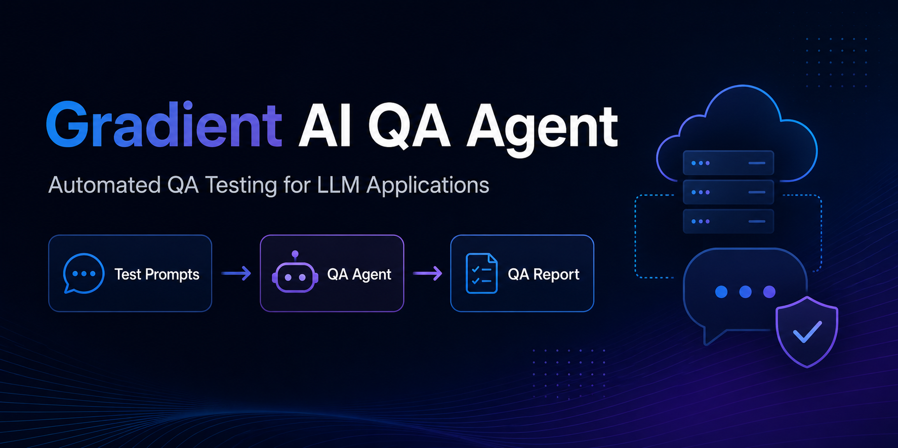
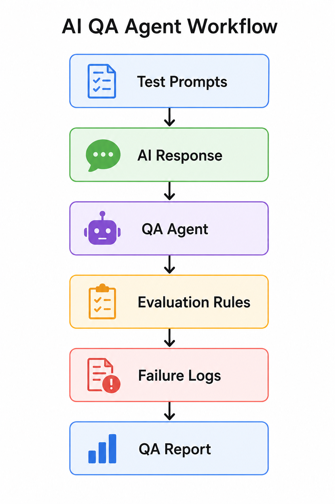

# Gradient AI QA Agent



A Python-based AI QA agent that tests LLM application responses, logs failures, and generates structured QA reports before production deployment.


# Gradient AI QA Agent — Complete GitHub Project

A complete markdown-formatted project package for your GitHub repository.

Use this document to create each file in your GitHub repo.

---

# 1. Repository Name

```text
gradient-ai-qa-agent
```

---

# 2. GitHub Description

```text
A Python-based AI QA agent that tests LLM responses, logs failures, and generates structured QA reports before production deployment.
```

---

# 3. Recommended GitHub Topics

```text
ai
llm
quality-assurance
ai-testing
python
digitalocean
gradient-ai
agentic-ai
observability
testing
```

---

# 4. Repository Structure

```text
gradient-ai-qa-agent/
├── README.md
├── requirements.txt
├── .env.example
├── agent.py
├── evaluator.py
├── qa_rules.py
├── report_generator.py
├── examples/
│   └── sample_prompts.json
├── outputs/
│   └── sample_qa_report.json
├── tests/
│   ├── test_evaluator.py
│   └── test_qa_rules.py
└── docs/
    ├── header.png
    └── architecture.png
```

---

## Why This Project Matters

Most AI agent demos stop when the first response works.

But production AI systems need more than a working demo. They need testing, logging, validation, repeatable evaluation, and clear failure reports.

This project shows how to build a lightweight QA layer for LLM applications. It checks AI responses for missing required facts, blocked terms, weak answers, and basic quality issues before those responses reach users.

The goal is simple:

> Turn manual AI response review into a repeatable QA workflow.

---

## What This Project Does

Gradient AI QA Agent helps test LLM outputs using simple rule-based checks.

It can:

- Load AI test prompts from a JSON file
- Generate mock LLM responses for local testing
- Evaluate responses against QA rules
- Check for required keywords
- Check for blocked or unsafe terms
- Check minimum response length
- Save a structured QA report
- Run basic unit tests for the QA logic

This is a proof-of-concept project. The first version uses mock responses so the QA workflow can be tested locally before connecting it to a real model or DigitalOcean Gradient endpoint.

---

## Architecture



```text
Test Prompts
     ↓
AI Response
     ↓
QA Agent
     ↓
Evaluation Rules
     ↓
Failure Logs
     ↓
QA Report
```

The workflow starts with sample prompts, runs each prompt through a mock AI response function, evaluates the response, and saves the results in a JSON report.

---

## Repository Structure

```text
gradient-ai-qa-agent/
├── README.md
├── requirements.txt
├── .env.example
├── agent.py
├── evaluator.py
├── qa_rules.py
├── report_generator.py
├── examples/
│   └── sample_prompts.json
├── outputs/
│   └── sample_qa_report.json
├── tests/
│   ├── test_evaluator.py
│   └── test_qa_rules.py
└── docs/
    ├── header.png
    └── architecture.png
```

---

## File Overview

| File | Purpose |
|---|---|
| `agent.py` | Runs the main QA workflow |
| `qa_rules.py` | Contains response quality checks |
| `evaluator.py` | Evaluates each AI response against a test case |
| `report_generator.py` | Saves QA results into a JSON report |
| `examples/sample_prompts.json` | Stores sample AI test cases |
| `outputs/sample_qa_report.json` | Stores the generated QA report |
| `tests/` | Contains unit tests for the QA logic |
| `.env.example` | Shows required environment variables |
| `requirements.txt` | Lists project dependencies |

---

## How It Works

The QA workflow has four main steps:

1. Load test cases from `examples/sample_prompts.json`
2. Generate or collect an AI response
3. Evaluate the response using QA rules
4. Save the final report in `outputs/sample_qa_report.json`

The current version uses a mock LLM response function. This keeps the project simple and easy to test locally.

Later, the mock response function can be replaced with a real DigitalOcean Gradient model or agent endpoint.

---

## Example Test Case

```json
{
  "id": "test_001",
  "prompt": "Explain password reset steps to a frustrated customer.",
  "required_keywords": ["password", "reset", "email"],
  "blocked_terms": ["stupid", "obviously", "your fault"],
  "expected_tone": "supportive",
  "min_words": 25
}
```

This test case checks whether the AI response:

- Mentions important required words
- Avoids blocked or unsafe terms
- Gives enough detail
- Matches the expected support use case

---

## Example Output

After the QA agent runs, it creates a report like this:

```json
{
  "total_tests": 3,
  "passed": 3,
  "failed": 0,
  "results": [
    {
      "test_id": "test_001",
      "prompt": "Explain password reset steps to a frustrated customer.",
      "passed": true,
      "checks": {
        "required_keywords": {
          "passed": true,
          "missing_keywords": []
        },
        "blocked_terms": {
          "passed": true,
          "blocked_terms_found": []
        },
        "minimum_length": {
          "passed": true,
          "word_count": 27,
          "minimum_required": 25
        }
      }
    }
  ]
}
```

---

## Prerequisites

Before running this project, make sure you have:

- Python 3.10 or higher
- Git
- pip
- Basic understanding of Python
- Optional: DigitalOcean account if you want to extend this with Gradient AI or ADK later

---

## Installation

Clone the repository:

```bash
git clone https://github.com/YOUR-USERNAME/gradient-ai-qa-agent.git
cd gradient-ai-qa-agent
```

Create a virtual environment:

```bash
python -m venv venv
```

Activate the virtual environment:

```bash
# Mac/Linux
source venv/bin/activate
```

```bash
# Windows
venv\Scripts\activate
```

Install dependencies:

```bash
pip install -r requirements.txt
```

---

## Environment Variables

Create a `.env` file using the `.env.example` file.

```bash
cp .env.example .env
```

Example `.env.example`:

```bash
DIGITALOCEAN_API_KEY=your_api_key_here
MODEL_NAME=your_model_name_here
ENVIRONMENT=development
```

Do not commit real API keys to GitHub.

The current version does not require a real API key because it uses mock responses for local testing.

---

## How to Run

Run the QA agent:

```bash
python agent.py
```

Expected terminal output:

```text
QA run complete
Total tests: 3
Passed: 3
Failed: 0
```

The report will be saved here:

```text
outputs/sample_qa_report.json
```

---

## Running Tests

Run the test suite with:

```bash
pytest tests/
```

Expected output:

```text
tests/test_evaluator.py ..
tests/test_qa_rules.py .....
```

The tests check whether the evaluator and QA rules are working correctly.

---

## Current QA Checks

The first version includes three simple checks:

### 1. Required Keyword Check

Confirms that important expected words appear in the response.

Example:

```text
Required keywords: password, reset, email
```

### 2. Blocked Terms Check

Flags unsafe, rude, or unwanted phrases.

Example:

```text
Blocked terms: stupid, obviously, your fault
```

### 3. Minimum Length Check

Checks whether the response has enough detail.

Example:

```text
Minimum words: 25
```

These checks are simple on purpose. They make the first version easy to understand, test, and extend.

---

## Why Start With Rule-Based QA?

AI evaluation can get complicated very quickly.

You can use embeddings, semantic similarity, LLM-as-judge scoring, retrieval checks, and human review workflows.

But the first version of a QA system should be easy to trust.

Rule-based checks are not perfect, but they are useful for catching obvious failures:

- Missing facts
- Unsafe words
- Very short answers
- Basic formatting problems
- Repeated response issues

This project starts with simple checks, then leaves room for more advanced evaluation later.

---

## DigitalOcean Gradient / ADK Extension

This repository is designed as a local proof-of-concept that can later be connected to DigitalOcean Gradient and the Agent Development Kit.

A future cloud version could:

- Replace `mock_llm_response()` with a real Gradient model call
- Deploy the QA agent using DigitalOcean ADK
- Run automated evaluations on agent outputs
- Store logs and traces
- Trigger QA checks before production deployment
- Run on a DigitalOcean Droplet or GPU Droplet

The long-term goal is to create a shift-left QA workflow for AI agents.

Instead of waiting for users to find bad outputs, teams can test agent behavior earlier.

---

## Roadmap

- [ ] Add DigitalOcean Gradient model endpoint integration
- [ ] Add ADK deployment workflow
- [ ] Add semantic similarity checks
- [ ] Add LLM-as-judge evaluation
- [ ] Add hallucination-risk scoring
- [ ] Add dashboard for QA reports
- [ ] Add CI/CD quality gate
- [ ] Add Docker support
- [ ] Add GitHub Actions workflow
- [ ] Add cloud deployment guide

---

## Troubleshooting

| Problem | Possible Cause | Fix |
|---|---|---|
| `ModuleNotFoundError` | Dependencies not installed | Run `pip install -r requirements.txt` |
| `FileNotFoundError` | Missing `sample_prompts.json` | Check the `examples/` folder |
| Empty report | No test cases loaded | Confirm JSON file has test cases |
| Tests not running | Pytest not installed | Run `pip install pytest` |
| API key error | `.env` missing or incorrect | Add values to `.env` |

---

## Example Use Cases

This project can be adapted for:

- AIML QA testing
- LLM response validation
- Customer support bot testing
- Prompt regression testing
- Agentic workflow testing
- AI safety pre-checks
- Tone and policy validation
- Model comparison tests
- Pre-deployment AI quality gates

---

## Limitations

This project is intentionally lightweight.

Current limitations:

- Uses mock LLM responses
- Uses rule-based checks only
- Does not yet call a real DigitalOcean Gradient endpoint
- Does not include semantic evaluation
- Does not include dashboard visualization
- Does not replace human review for high-risk AI systems

This is the first useful version, not the final production system.

---

## Future Production Improvements

For production use, I would add:

- Real model endpoint integration
- Prompt version tracking
- Model version tracking
- Run timestamps
- Failure category labels
- Retry tracking
- Cost tracking
- Latency tracking
- CI/CD integration
- Human review for high-risk outputs

The goal is not just to test one response.

The goal is to make AI quality measurable over time.

---

## Medium Article

Full write-up:

```text
[Medium Link]
```

---

## Contributing

Contributions are welcome.

You can improve this project by:

- Adding new QA rules
- Adding DigitalOcean Gradient integration
- Improving test coverage
- Adding dashboard support
- Improving documentation
- Adding more example test cases

To contribute:

1. Fork the repository
2. Create a new branch
3. Make your changes
4. Open a pull request

---

## License

This project is licensed under the MIT License.

---

## Final Note

Most AI demos prove that an agent can answer once.

Production AI systems need to prove something harder:

> The agent can behave reliably across repeated prompts, changing inputs, and real user workflows.

This project is a small step toward that goal.
```

